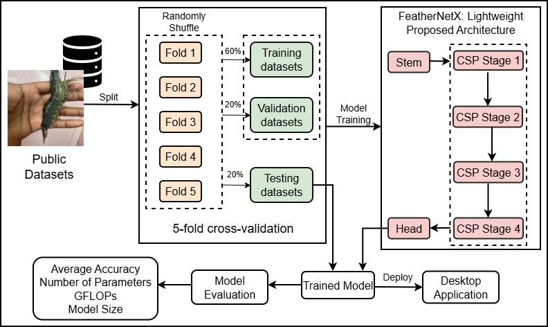
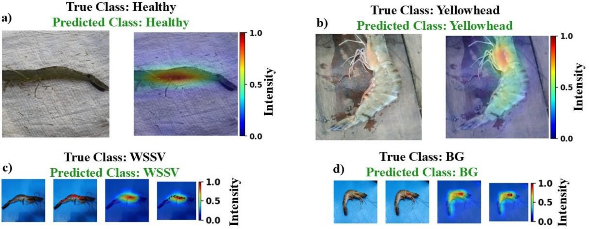
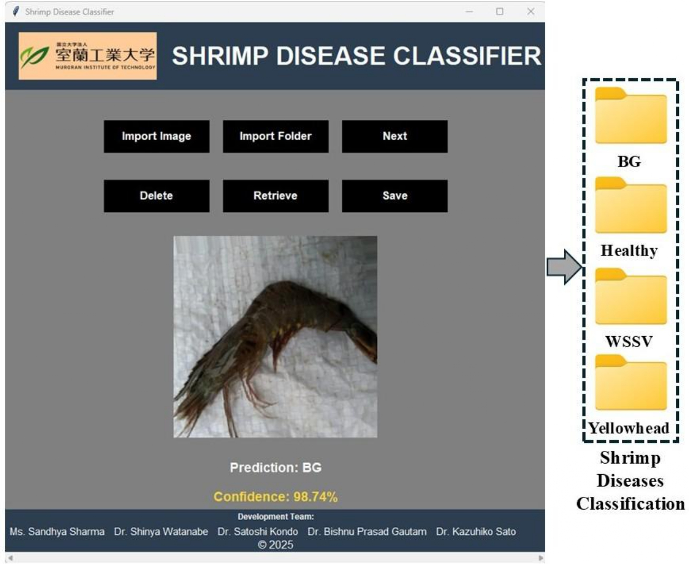

Muroran IT: "FeatherNetX: A Lightweight CNN Architecture for Shrimp Diseases Automatic Classification"

Real-Time Shrimp Disease Classification
We developed FeatherNetX, a lightweight CNN optimized for efficient shrimp disease detection. The model achieves 93% accuracy with only 0.739M parameters, 2.82 MB memory footprint, and 0.48 GFLOPs, making it highly efficient for real-world deployment. Integrated into a desktop application, FeatherNetX demonstrates 94% accuracy on unseen data with 0.2s inference per image, enabling real-time, offline diagnosis without internet dependency.

  

Explainable AI Visualization
To visualize the image regions that mostly influenced the model’s predictions, we employed Grad-CAM++ technique as a qualitative suitability and alignment check. The resulting heatmaps, normalized to a range of 0 to 1, highlight areas of high relative activation (where values closer to 1 indicate the most salient regions within an image). Visual inspection suggested that for many cases across all disease classes, these high-activation regions often corresponded to visibly affected tissue. For the BG and WSSV classes, where spatial annotations were available, we further quantified this alignment. We observed that the peak model activation frequently aligned with the annotated diseased areas. In a subset of cases, the peak activation was offset from the ground-truth annotation, highlighting a potential focus for future refinement in model localization or annotation consistency. Our analysis further revealed a negative correlation between activation intensity and distance from bounding box centers, supporting the model’s capability for disease localization.

  

Standalone Desktop Application
The FeatherNetX model is deployed within a desktop application that requires no internet connection, making it especially suitable for remote shrimp farms. The system provides fast, reliable classification results directly to farmers, helping to prevent economic losses through early intervention.

  

Implementation

Requires Python 3.8 or higher

Desktop App: Run application_desktop to launch the standalone GUI application for shrimp disease classification.

